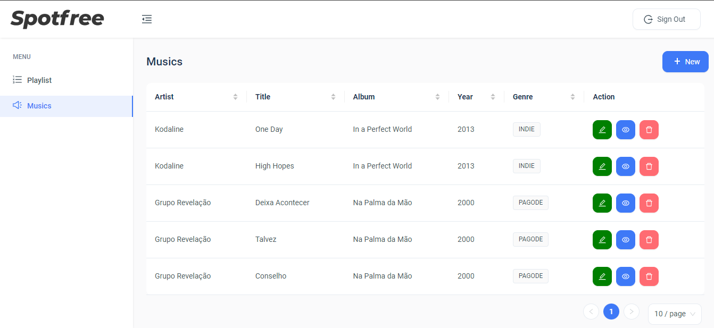

# Spotfree - Front



## 💻 Pré-requisitos

Antes de começar, verifique se você atendeu aos seguintes requisitos:
* Você instalou `Node 16`
* Você instalou `Npm 9.7`
* Se atente de ter subido a API
*  * <a href="https://github.com/JuniorFrancis/spotfree" > Repositório da API </a>

## 🚀 Instalando Spotfree - Front

Para instalar o Spotfree, siga estas etapas:

```
npm install --force
```


## ☕ Usando Spotfree

Para usar Spotfree, siga estas etapas:

```
npm start
```


## 🤝 Colaboradores

<table>
  <tr>
    <td align="center">
      <a href="#">
        <br>
        <sub>
          <b>Antonio Junior</b>
        </sub>
      </a>
    </td>
  </tr>
</table>
